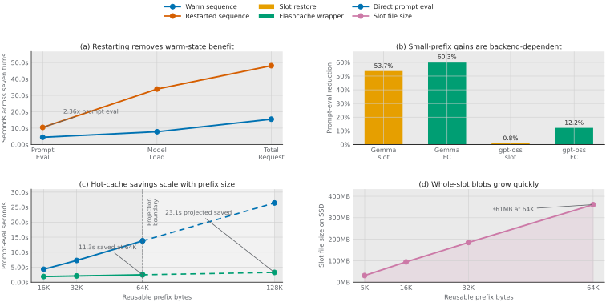
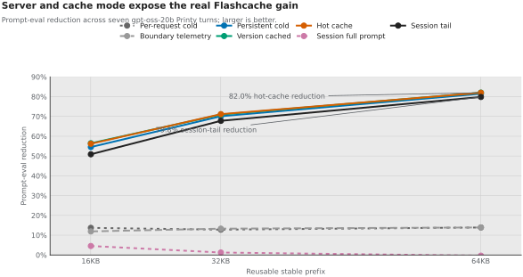

# Benchmark Graphs

Date: 2026-06-03

These graphs summarize what the current Printy / Print-a-Bot benchmark data says about Flashcache and SSD-backed prompt or KV state. The browser page is formatted as a paper-style figure note; this Markdown file keeps the same claims easy for agents to scan.

For a browser-friendly version, open [Benchmark Graphs HTML](benchmark-graphs.html).

The charts are generated with Matplotlib from the raw JSON files under:

- `benchmarks/datasets/printtestbot-printing-press-2026-06-02/raw/`
- `benchmarks/datasets/printtestbot-large-prefix-2026-06-02/raw/`
- `benchmarks/datasets/printtestbot-boundary-telemetry-2026-06-03/raw/`
- `benchmarks/datasets/printtestbot-persistent-server-2026-06-03/raw/`
- `benchmarks/datasets/printtestbot-server-version-cache-2026-06-03/raw/`
- `benchmarks/datasets/printtestbot-hot-cache-2026-06-03/raw/`

Regenerate them with:

```bash
python3 -m pip install -r requirements-dev.txt
python3 benchmarks/plot_benchmark_graphs.py
```

Each chart is exported as SVG, PDF, and PNG under `docs/assets/benchmark-graphs/`.

## Primary Paper Figure



Figure 1 is the best artifact to use when explaining the research claim. It combines the current evidence:

- warm-state loss after restart,
- backend-dependent small-prefix savings,
- hot-cache savings as reusable prefixes grow,
- and the SSD cost of whole-slot blobs.

The figure marks the 128KB point as a projection, not a measured result.

## What We Learned

1. Warm local agent loops are much cheaper than restarted local agent loops.
2. Exact prompt replay is already easy; it is not the interesting product claim.
3. On the small 5.5KB reusable prefix, the tiny Gemma model shows a big cache win, but `gpt-oss-20b` direct slot restore is basically flat.
4. The Flashcache wrapper gives a repeatable `gpt-oss-20b` win around 12% on the small Printy prefix.
5. The older per-request cold large-prefix run showed about 13.9% savings at 64KB, but the newer persistent/hot-cache runs expose the steady-state value: the 64KB hot-cache run saves 82.0% of prompt-eval time.
6. Saved slot files get large quickly, so the next layer needs restore-once session residency, partial restore, better layout, and I/O instrumentation instead of whole-slot blobs forever.

## Warm vs Restarted


The strongest current signal is the persistence gap. Ollama keeps changed-tail prompts warm while the model stays loaded, but restarts lose much of that benefit.

For the seven-turn Printy workflow:

- warm prompt eval sum: `4.43s`
- restarted prompt eval sum: `10.46s`
- restarted prompt eval was `2.36x` warm
- restarted total request time was `48.11s` versus `15.46s` warm

This is the opening for persistent SSD-backed state. The goal is to keep useful prefix/KV state alive across cold or restarted sessions.

## Exact Replay Control


Exact replay gets cheap: the second identical Ollama prompt dropped from about `462ms` prompt eval to `74ms`.

That proves a known primitive, not our deeper thesis. Real agent work is changed-tail reuse: the stable prefix repeats, but command output, diffs, tool results, and planner state keep changing.

## Small Prefix Cache Outcomes


On the original Printy fixture with a 5.5KB reusable prefix:

- Gemma slot restore saved `53.7%`.
- Gemma Flashcache saved `60.3%`.
- `gpt-oss-20b` direct slot restore averaged only `0.8%`.
- `gpt-oss-20b` Flashcache wrapper averaged `12.2%`.

Interpretation: cache mechanics work, but the bigger model/backend does not automatically turn whole-slot restore into a large win at this prefix size. The wrapper path is better, but the result says we need deeper timing around restore, prefill, copy/upload, and tail handling.

## Large Prefix Hot-Cache Ladder


The hot-cache large-prefix ladder is closer to the future local-agent problem: long stable repo/tool/session context already persisted on disk plus small changing tails.

For `gpt-oss-20b` over seven turns:

| Reusable prefix | Direct prompt eval | Flashcache prompt eval | Saved |
| --- | ---: | ---: | ---: |
| 16KB | 4.32s | 1.89s | 2.43s |
| 32KB | 7.25s | 2.09s | 5.16s |
| 64KB | 13.77s | 2.48s | 11.29s |

The percentage win grows from 56.2% to 82.0% as prefix size grows. That supports the direction: local agent workloads get interesting when reusable context becomes large, persistent, and already warm on disk.

## Cache Mode Comparison



The new benchmark data shows why measurement mode matters:

- per-request cold at 64KB: `13.9%` prompt-eval reduction
- persistent cold at 64KB: `81.5%` prompt-eval reduction
- server-version cached cold at 64KB: `82.0%` prompt-eval reduction
- hot cache at 64KB: `82.0%` prompt-eval reduction with `100%` measured cache hits

Interpretation: process startup and repeated wrapper overhead were obscuring the steady-state local-agent shape. Hot cache is the best current approximation of a regular session after stable context has already been persisted.

## SSD Cost


The cost side is obvious too. Whole-slot files are big:

| Reusable prefix | Slot file |
| --- | ---: |
| 5.4KB | 31.1MB |
| 16.0KB | 94.5MB |
| 32.0KB | 184.8MB |
| 64.0KB | 361.0MB |

This is why the next Flashcache layer should not stop at whole-slot blobs. We need block layout, partial restore, cache eviction, and I/O telemetry.

## Gains Projection


The projection figure combines the measured hot-cache large-prefix ladder with the next research target. The 128KB point is a directional linear projection from the measured 16KB, 32KB, and 64KB hot-cache results, not a measured benchmark result.

The current projection is:

- measured 64KB hot-cache savings: `11.3s` across seven turns
- projected 128KB hot-cache savings: `23.1s` across seven turns
- next target: a restore-once session benchmark that avoids per-turn whole-slot restore where possible

## Next Graphs To Add

- prefill vs restore vs save time
- SSD read/write bytes and throughput
- GPU or accelerator upload time, if observable
- tail-only prefill time after restored prefix
- quality or next-action agreement against uncached baseline

The current data says Flashcache is worth taking deeper, but the next round must explain where the time goes.
