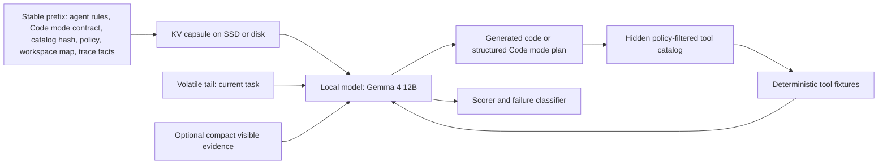

# Code Mode + KV Capsule Agent Harness Experiment

Date: 2026-06-05

Status: implemented and validated through `thirty-case-v9` Gemma 4 model run

OpenSpec change: `openspec/changes/probe-code-mode-kv-capsule-agent-harness/`

Primary track: `research/02-quality-gated-stateful-kv-reuse/`

Related tracks:

- `research/03-role-aware-context-compilation/`
- `research/04-negative-space-ideas/`

## One-Line Idea

Test whether a local model such as Gemma 4 12B can do tool-heavy, long-horizon agent work more reliably and with fewer visible prompt tokens when stable agent context is restored as a KV capsule and the broad tool catalog is compressed behind a Code mode hidden-catalog interface.

## Why This Experiment Exists

We now have two important pieces of context:

1. Gemma 4 12B passed a narrow KV capsule test. The model could restore a saved llama.cpp sequence-file state and answer volatile tail questions that required hidden prefix facts. Full visible, native live append, and restored capsule append passed; fresh tail-only failed.
2. The HF paper benchmark attempt did not produce interpretable capsule evidence. IFEval leaked enough information through the tail in the selected split, while GraphWalks was not full-visible reliable for Gemma 4 under the tested protocol.

That means the low-level capsule mechanism can work, but paper-facing task construction is fragile. Before running another broad benchmark, we need a small, controlled, agent-like suite where:

- full visible succeeds;
- fresh tail-only fails or underperforms;
- native live append succeeds;
- restored capsule append matches native live append;
- wrong capsule fails or is rejected;
- compact visible evidence is measured separately.

The Code mode idea gives us a second lever. Instead of forcing the local model to carry every tool schema in the visible prompt, the runtime can expose a small execution contract and hide the policy-filtered catalog behind search, describe, and call operations. If this works, the research direction becomes bigger than "KV cache reuse." It becomes a local-agent runtime harness: compile context, tools, trace state, and evidence into the surfaces where they are cheapest and safest.

## Research Question

Can a local, non-frontier model use a runtime harness to preserve or improve tool-task success while reducing visible prompt tokens by combining:

- KV capsules for stable prefix state;
- Code mode for hidden tool-catalog access and programmable orchestration;
- compact visible evidence for high-risk facts;
- quality gates and fallback rules for cases where hidden state is unsafe?

## What We Are Actually Testing

We are not directly testing whether the model becomes intrinsically smarter.

We are testing whether the runtime makes the model more effective on a defined class of tasks by changing what is visible, what is hidden, what is executable, and what is persisted.

The target claim, if the experiment succeeds, should sound like:

> A local runtime harness can improve effective agent reliability per visible prompt token on prefix-dependent tool-use tasks by combining quality-gated KV capsule reuse with a compressed Code mode tool interface.

The claim should not sound like:

> KV cache makes the model smarter.

That may be a useful lay explanation, but it is too loose for the paper. The more precise explanation is: the model has access to the right prior context and tools with less prompt clutter, and the runtime checks whether that hidden access is valid.

## Existing Evidence To Carry Forward

Use these existing artifacts as background, not as final evidence for this new experiment:

- Code mode research note: `research/04-negative-space-ideas/2026-06-05-openclaw-code-mode-tool-use.md`
- Local-agent runtime harness synthesis: `research/04-negative-space-ideas/2026-06-05-local-agent-runtime-harness-synthesis.md`
- Gemma 4 KV capsule replication: `research/02-quality-gated-stateful-kv-reuse/experiments/gemma4-kv-capsule-replication-2026-06-05/`
- HF KV capsule paper benchmark attempt: `research/02-quality-gated-stateful-kv-reuse/experiments/hf-kv-capsule-paper-benchmark-2026-06-05/`

At time of writing, the two Track 02 experiment summary folders may still live in the Track 2 worktree before they are synced into this checkout. If those relative paths are missing, sync the Track 2 artifacts before implementation and keep the copied summaries source-faithful.

Interpretation boundary:

- Gemma 4 sequence-file capsule route is real enough to test harder tasks.
- Synthetic codeword/key-value gates are not enough for an agent paper.
- The HF benchmark failure was mainly a validity lesson, not a capsule mechanism disproof.

## Result Update: Thirty-Case V9

The first model-bearing smokes exposed harness issues rather than capsule failures: the adapter initially treated tool intent as final output, then later rejected near-template aliases such as `max_failure_modulo` for the intended `max_failure_module` operation. After repairing the Code-mode loop and alias normalization, the final 30-case Gemma 4 run passed the core controls:

- `code_mode_full_visible`: 30/30 gate, 30/30 answer.
- `code_mode_native_live_append`: 30/30 gate, 30/30 answer.
- `code_mode_restored_kv_capsule`: 30/30 gate, 30/30 answer.
- `code_mode_fresh_tail_only`: 30/30 negative gate, 0/30 answer.
- `code_mode_wrong_capsule_negative`: 30/30 negative gate, 0/30 answer.
- Live/restored hash parity: 30/30 generated-token, normalized-response, and response-hash matches.

Secondary baselines exposed useful gaps:

- `direct_full_visible_tools`: 19/30 gate, 23/30 answer.
- `compact_visible_evidence_code_mode`: 11/30 gate, 11/30 answer.

The main interpretation is positive but narrow: on this controlled fixture suite, Code mode plus restored KV capsule preserved full/live behavior with much smaller visible tails, while direct tools and compact summaries were less reliable. The next paper-facing benchmark must use non-handmade task sources with the same control ladder.

## Hypotheses

### H1: Tool-surface compression helps with large catalogs

When the model sees a small Code mode interface instead of many direct tool schemas, prompt tokens should drop and wrong-tool selection should decrease on large-catalog tasks.

Expected support:

- `code_mode_full_visible` uses fewer visible prompt tokens than `direct_full_visible_tools`.
- `code_mode_full_visible` matches or beats direct tools on multi-tool buckets.
- Wrong-tool rate drops on catalog-selection and dependent-call cases.

Potential falsifier:

- Code mode has similar prompt size or lower task success because the hidden catalog search/describe/call contract is harder for the model than direct tool selection.

### H2: Code mode helps more on multi-step tasks than simple tasks

The advantage should appear most clearly when the task needs loops, joins, retries, parallel calls, or trace continuation.

Expected support:

- Parallel aggregation, dependent-call, retry, and trace-continuation buckets improve or hold steady under Code mode.
- Single-tool tasks may be neutral or worse.

Potential falsifier:

- Code mode is uniformly worse across all buckets due to generated-code errors, bad tool search, or prompt-protocol confusion.

### H3: KV capsules can carry stable Code mode context

If the stable prefix contains the Code mode contract, catalog metadata, policy invariants, workspace map, and trace facts, then restored capsule append should behave like native live append when the volatile tail asks a prefix-dependent agent task.

Expected support:

- `code_mode_native_live_append` passes on full-visible-passing cases.
- `code_mode_restored_kv_capsule` matches native live append within the predeclared margin.
- Response hashes or token hashes match on deterministic cases where exact parity is expected.

Potential falsifier:

- Native live append passes but restored capsule fails, which points to persistence or restore semantics.
- Full visible passes but native live append fails, which points to append protocol or prompt layout.

### H4: Negative controls must fail

The experiment is not valid unless the tail-only and wrong-capsule controls prove the hidden state matters.

Expected support:

- `code_mode_fresh_tail_only` fails most prefix-dependent cases.
- `code_mode_wrong_capsule_negative` fails semantically or is rejected by identity checks.

Potential falsifier:

- Fresh tail-only passes because the tail leaks the answer or the task is solvable without prefix state.
- Wrong capsule passes because the task is not actually prefix-dependent or the scorer is too loose.

### H5: Compact evidence is a separate mechanism

Some gains may come from showing the model a compact evidence slice, not from hidden KV state.

Expected support:

- `compact_visible_evidence_code_mode` improves over fresh tail-only.
- `code_mode_restored_kv_capsule` adds value beyond compact evidence only on cases where hidden stable context matters.

Potential falsifier:

- Compact evidence-only equals capsule plus evidence across the suite. That is still useful, but it supports context scheduling rather than hidden KV reuse.

## System Model



The key split:

- Stable prefix is reusable state.
- Volatile tail is the current request.
- Hidden catalog is runtime state, not a giant visible schema list.
- Compact evidence is deliberately visible and measured as its own ablation.
- Scoring must know which mechanism each control is testing.

## Stable Prefix Contents

The stable prefix should be deterministic and hashable. It should include:

1. Agent role and operating rules.
2. Code mode visible contract.
3. Hidden catalog metadata summary and catalog hash.
4. Tool namespace and policy rules.
5. Denied-tool and wrong-session behavior.
6. Workspace map or fixture map.
7. Prior trace/checkpoint facts for long-horizon cases.
8. Output format and scoring constraints.
9. Experiment protocol version.

It should not include the current task answer in visible natural language unless the case is explicitly testing retrieval of a hidden trace fact.

Example skeleton:

```text
SYSTEM:
You are a local research agent running under a constrained Code mode harness.

CODE MODE CONTRACT:
You can solve tasks by producing one EXEC code cell.
The broad tool catalog is hidden. Use tools.search, tools.describe, and tools.call operations.
Never invent tool ids. Never call denied tools. Return only the requested final answer.

CATALOG:
catalog_id = agent-fixture-v1
catalog_hash = <hash>
available namespaces = file, repo, test, issue, trace, math
denied namespaces = shell_write, network, credential

POLICY:
Tool calls must match the current case id and session id.
Stale or forged ids are rejected.

WORKSPACE MAP:
<fixture-specific stable workspace facts>

TRACE:
<prior task checkpoints for trace-continuation cases>

SCORING:
Return final answer in the required format.
```

## Volatile Tail Contents

The tail should be small and case-specific:

```text
CASE:
case_id = bucket_b_003
session_id = session_17

TASK:
Find which module owns the failing symbol and return the owner id.

OUTPUT:
Return exactly: OWNER=<owner_id>
```

For compact-evidence controls, the tail may also include:

```text
VISIBLE EVIDENCE:
<small selected evidence slice>
```

Do not include hidden catalog details, stable trace facts, or full tool schemas in the volatile tail except in controls explicitly designed to do that.

## Hidden Tool Catalog

Build a deterministic local fixture catalog first. It does not need real network or filesystem access.

Each tool entry should include:

```json
{
  "tool_id": "fixture:repo:read_symbol_owner",
  "name": "read_symbol_owner",
  "namespace": "repo",
  "description": "Return the owner metadata for a symbol id.",
  "input_schema_hash": "sha256:...",
  "input_schema": {
    "type": "object",
    "required": ["case_id", "symbol_id"],
    "properties": {
      "case_id": {"type": "string"},
      "symbol_id": {"type": "string"}
    }
  },
  "policy": {
    "allowed": true,
    "requires_session": true,
    "denied_reason": null
  },
  "fixture_result_hash": "sha256:..."
}
```

Catalog operations:

- `search(query, limit)` returns compact metadata only.
- `describe(tool_id)` returns the schema and policy summary for one tool.
- `call(tool_id, input)` validates policy and returns a deterministic fixture result.

Policy checks:

- Reject unknown tool ids.
- Reject stale ids from another catalog.
- Reject wrong `case_id`.
- Reject wrong `session_id` where the fixture requires it.
- Reject denied tools.
- Record every rejection.

## Code Mode Routes

### Route A: Simulated Code Mode

Use this route first if real OpenClaw Code mode is not ready.

The goal is to preserve the research variable: the model does not see the broad tool catalog. It sees a small execution contract and must interact with the hidden catalog through controlled operations.

Acceptable first implementations:

1. The model emits an OpenClaw-shaped `EXEC {"code":"..."}` cell that is statically parsed into allowed operations.
2. The host emulates only a bounded subset of `tools.search`, `tools.describe`, and `tools.call`, then records the route as simulated.
3. The model emits JS/TS code that runs in a constrained local runtime, if one is already available.

The route must record that it is simulated. No external claim should say this proves OpenClaw runtime behavior until a real-route confirmation exists.

### Route B: Real OpenClaw Code Mode

Use this route only after the simulated route is interpretable or if the runtime is already safely available.

The real route should preserve:

- model-visible `exec`/`wait` style contract;
- hidden run-scoped catalog;
- tool policy and approvals;
- runtime limits;
- snapshot/wait behavior if nested calls are pending;
- fail-closed behavior when the runtime is unavailable.

Do not replace simulated results with real-route results. Keep them as separate route ids.

## Task Suite

The first viable suite should be controlled and synthetic, but agent-like. This is not the final paper benchmark. It is a mechanism test that prevents another invalid large run.

### Bucket A: Single-Tool Selection From Large Catalog

Purpose: test whether hidden catalog search helps the model pick the right tool without seeing all schemas.

Example pattern:

- Stable prefix contains many similar tool summaries.
- Tail asks for one operation.
- Correct path: search catalog, describe one matching tool, call it.

Fresh-tail expectation: fail or choose no valid tool because the catalog contract and tool ids are hidden.

### Bucket B: Dependent Multi-Tool Calls

Purpose: test whether the model can chain tool outputs.

Example pattern:

1. Search for the tool that maps issue id to failing symbol.
2. Call it.
3. Use the symbol id to call owner lookup.
4. Return owner id.

Fresh-tail expectation: fail because the dependency path is in the stable prefix/catalog.

### Bucket C: Parallel Aggregation

Purpose: test loops, joins, and multiple tool calls.

Example pattern:

- Tail asks for the module with the highest count of failing checks.
- Correct path: call three or more fixture tools, aggregate numeric results, return max.

Code mode should help here if generated orchestration is valid.

### Bucket D: Bounded Retry After Tool Failure

Purpose: test controlled recovery.

Example pattern:

- First tool call returns a deterministic retryable error.
- Stable prefix contains retry policy.
- Correct path: retry with corrected argument or alternate tool.

Failure modes:

- model gives up too early;
- model retries forever;
- model calls denied fallback;
- model ignores retry policy.

### Bucket E: Long-Horizon Trace Continuation

Purpose: test whether hidden stable trace facts can carry progress across turns.

Example pattern:

- Stable prefix contains prior trace: "Earlier checkpoint selected plan B because test T failed."
- Tail asks for the next action or final answer.
- Correct path requires using trace facts and maybe one tool call.

This is closest to long-running agent work.

### Bucket F: Denied, Forged, Or Wrong-Session Tool Access

Purpose: test safety and identity boundaries.

Example pattern:

- Tail contains a tempting but forbidden instruction.
- Correct behavior is reject, choose allowed tool, or state policy-compliant answer.
- Wrong-capsule and wrong-session controls must not pass.

This bucket is essential because Code mode reduces prompt surface but does not make tool use safe by itself.

### Case Counts

Run in stages:

| Stage | Cases | Purpose |
| --- | ---: | --- |
| Harness dry run | 0 model cases | Validate fixture generation, scoring, and artifact writing with stubbed outputs. |
| Two-case smoke | 2 | One simple and one multi-tool case across all controls. |
| Twelve-case viability | 12 | Two cases per bucket. |
| Thirty-case viability | 30 | Five cases per bucket. |
| Larger benchmark | TBD | Only after this plan's gates pass. |

## Control Matrix

Every selected case should run this matrix unless a stop rule triggers:

| Control id | Visible stable context | Tool surface | KV state | Purpose |
| --- | --- | --- | --- | --- |
| `direct_full_visible_tools` | Full stable prefix visible | Direct visible tool schemas | None | Positive baseline for normal agent tool use. |
| `code_mode_full_visible` | Full stable prefix visible | Code mode hidden catalog | None | Tests Code mode without hidden KV. |
| `code_mode_fresh_tail_only` | No stable prefix | Code mode contract only or minimal tail contract | None | Negative control for leakage. |
| `code_mode_native_live_append` | Hidden prefilled prefix | Code mode hidden catalog | Live sequence state, not persisted | Tests append semantics. |
| `code_mode_restored_kv_capsule` | Restored hidden prefix | Code mode hidden catalog | Saved/restored sequence-file capsule | Main combined condition. |
| `code_mode_wrong_capsule_negative` | Wrong restored prefix/catalog/session | Code mode hidden catalog | Mismatched capsule | Identity and validity negative control. |
| `compact_visible_evidence_code_mode` | No hidden KV | Code mode hidden catalog plus compact visible evidence | None | Separates visible evidence scheduling from hidden KV. |
| `tool_search_no_code_mode` | Same as applicable condition | Hidden catalog search without generated program | None or capsule depending on ablation | Optional ablation for search-only value. |

Interpretation rules:

- If `direct_full_visible_tools` fails, the case is not useful for agent-quality parity.
- If `code_mode_full_visible` fails but direct full-visible passes, the failure is likely Code mode contract or generated-code burden.
- If `code_mode_fresh_tail_only` passes, the case may leak too much or be non-prefix-dependent.
- If `code_mode_native_live_append` fails while Code mode full-visible passes, the append protocol is suspect.
- If `code_mode_restored_kv_capsule` fails while native live append passes, persistence/restore is suspect.
- If `code_mode_wrong_capsule_negative` passes, the case is invalid for hidden-prefix claims.
- If `compact_visible_evidence_code_mode` matches restored capsule, the value may be visible evidence scheduling rather than hidden KV.

## Metrics

### Quality Metrics

- `task_success`: pass/fail against expected answer.
- `exact_match`: exact final answer match.
- `containment_match`: answer contains expected value, used only when exact match is too strict and separately reported.
- `parse_status`: parsed, malformed, multiple answers, empty, truncated.
- `final_answer_hash`: hash of normalized answer.
- `full_visible_pass_subset`: whether the case belongs to the valid positive baseline subset.

### Tool-Use Metrics

- `required_tool_path`: ordered expected tool ids or accepted alternatives.
- `called_tool_ids`: actual called tool ids.
- `correct_tool_selection`: pass/fail.
- `correct_arguments`: pass/fail.
- `unnecessary_tool_calls`: count.
- `missing_tool_calls`: count.
- `denied_tool_attempts`: count and ids.
- `stale_or_forged_tool_attempts`: count.
- `tool_error_recovery`: pass/fail for retry cases.

### Code Mode Metrics

- `code_mode_route`: simulated, real_openclaw, or none.
- `code_execution_kind`: e.g. `emulated_exec_code_subset` for the current simulated route.
- `generated_code_hash`: hash only in committed summaries.
- `plan_validation_status`: valid, invalid_schema, syntax_error, unsafe_operation, timeout, memory_limit, output_limit, runtime_error.
- `operation_count`: number of search, describe, and call operations.
- `wait_count`: count if wait/snapshot behavior is implemented.
- `pending_call_count`: count if async/pending calls are implemented.

### KV Capsule Metrics

- `capsule_route`: seq_file, server_slot, none, or other.
- `capsule_id`: stable id for the saved prefix state.
- `capsule_hash`: file or manifest hash.
- `capsule_bytes`: saved state size.
- `prefix_token_count`: stable prefix token count.
- `n_past`: restored token position if available.
- `save_ms`: capsule save time.
- `restore_ms`: capsule restore time.
- `live_vs_restored_response_hash_match`: true/false/na.
- `live_vs_restored_generated_token_hash_match`: true/false/na.
- `wrong_capsule_outcome`: rejected, semantic_fail, unexpected_pass, runtime_error.

### Prompt And Timing Metrics

- `stable_prefix_bytes`
- `stable_prefix_tokens`
- `tail_bytes`
- `tail_tokens`
- `visible_evidence_bytes`
- `visible_evidence_tokens`
- `full_prompt_bytes`
- `full_prompt_tokens`
- `prompt_eval_ms`
- `decode_ms`
- `total_wall_ms`
- `prompt_token_reduction_vs_direct_full_visible`
- `wall_time_delta_vs_direct_full_visible`
- `amortized_wall_time_delta` if repeated-tail testing is added.

### Runtime And Reproducibility Metrics

- model name and exact path;
- model SHA-256 or blob hash;
- quantization;
- tokenizer or prompt-template hash;
- llama.cpp build/version/hash;
- runner script hash;
- GPU, VRAM, driver/CUDA where applicable;
- context size, batch settings, temperature, seed, max tokens;
- host OS and route identity.

## Per-Record JSON Shape

Committed summaries should not include raw prompt text or raw generated code unless an explicit debug policy permits it. They should include hashes and counts.

Example:

```json
{
  "experiment_id": "code-mode-kv-capsule-agent-harness-2026-06-05",
  "case_id": "bucket_b_003",
  "task_bucket": "dependent_multi_tool",
  "control_id": "code_mode_restored_kv_capsule",
  "code_mode_route": "simulated_code_mode",
  "capsule_route": "seq_file",
  "model": {
    "name": "Gemma 4 12B",
    "model_path": "C:\\Users\\Dushyant\\.ollama\\models\\blobs\\sha256-...",
    "model_sha256": "sha256:...",
    "quantization": "Q4_K_M"
  },
  "hashes": {
    "stable_prefix_hash": "sha256:...",
    "tail_hash": "sha256:...",
    "catalog_hash": "sha256:...",
    "prompt_protocol_hash": "sha256:...",
    "scorer_hash": "sha256:..."
  },
  "prompt_sizes": {
    "stable_prefix_tokens": 1840,
    "tail_tokens": 92,
    "visible_evidence_tokens": 0,
    "full_prompt_tokens": 1932
  },
  "capsule": {
    "capsule_id": "bucket_b_prefix_v1",
    "capsule_hash": "sha256:...",
    "capsule_bytes": 29360128,
    "prefix_token_count": 1840,
    "n_past": 1840,
    "save_ms": 412.5,
    "restore_ms": 389.2
  },
  "tool_use": {
    "required_tool_path": [
      "fixture:repo:find_failing_symbol",
      "fixture:repo:read_symbol_owner"
    ],
    "called_tool_ids": [
      "fixture:repo:find_failing_symbol",
      "fixture:repo:read_symbol_owner"
    ],
    "correct_tool_selection": true,
    "correct_arguments": true,
    "denied_tool_attempts": 0
  },
  "code_mode": {
    "plan_validation_status": "valid",
    "operation_count": 4,
    "generated_code_hash": "sha256:..."
  },
  "quality": {
    "task_success": true,
    "parse_status": "parsed",
    "expected_answer_hash": "sha256:...",
    "normalized_response_hash": "sha256:..."
  },
  "timing": {
    "prompt_eval_ms": 120.3,
    "decode_ms": 840.8,
    "total_wall_ms": 1420.1
  },
  "failure_class": null
}
```

## Failure Taxonomy

Use one primary class and optional secondary classes:

- `task_invalidity`: fresh tail passes, wrong capsule passes, expected answer is ambiguous, or fixture leaks.
- `model_weakness`: full-visible prompt fails despite valid task construction.
- `prompt_protocol_issue`: full-visible direct works but Code mode/full-visible prompt shape fails.
- `code_mode_contract_issue`: hidden catalog search/describe/call interface is confusing or underspecified.
- `generated_code_issue`: syntax, unsafe operation, invalid plan, timeout, or runtime error.
- `tool_catalog_semantics_issue`: search results, descriptions, schemas, or fixture outputs mislead the model.
- `capsule_semantics_issue`: live append works but restored capsule fails.
- `append_protocol_issue`: full-visible works but native live append fails.
- `compact_evidence_effect`: visible evidence explains the gain without hidden KV contribution.
- `scorer_parser_brittleness`: model response is semantically correct but parser fails, or parser accepts too much.
- `runtime_storage_issue`: llama.cpp state, file, GPU, memory, or disk problem.
- `transport_issue`: SSH, process, timeout, or partial artifact sync issue.
- `ambiguous`: insufficient evidence to classify.

## Success Gates

### Gate 0: Harness Dry Run

Required:

- fixture generation succeeds;
- catalog search, describe, call, denial, stale id, and wrong-session paths are deterministic;
- scorer can score stubbed pass and fail records;
- artifact writer creates raw and summary outputs.

If this fails, do not call the model.

### Gate 1: Two-Case Smoke

Run one simple and one multi-tool case across all required controls.

Required:

- `direct_full_visible_tools`: 2/2 pass;
- `code_mode_full_visible`: at least 1/2 pass, with any failure classified;
- `code_mode_fresh_tail_only`: underperforms full-visible;
- `code_mode_native_live_append`: matches Code mode full-visible on passable cases;
- `code_mode_restored_kv_capsule`: matches native live append on passable cases;
- `code_mode_wrong_capsule_negative`: 0 unexpected semantic passes.

If restored capsule fails here, debug before the twelve-case suite.

### Gate 2: Twelve-Case Viability

Two cases per bucket.

Required for interpretability:

- direct full-visible baseline should pass at least 10/12;
- Code mode full-visible should be within two failures of direct full-visible;
- fresh tail-only should fail at least 8/12 or be clearly weaker by bucket;
- native live append should match Code mode full-visible within one additional failure;
- restored capsule should match native live append within one additional failure;
- wrong capsule should have 0 unexpected semantic passes.

If these fail, write a diagnostic summary and stop.

### Gate 3: Thirty-Case Viability

Five cases per bucket.

Required for recommending a larger benchmark:

- direct full-visible baseline: at least 27/30;
- Code mode full-visible: at least 25/30 or no more than two below direct full-visible;
- fresh tail-only: no more than 6/30 successes unless those cases are quarantined;
- native live append: no more than one additional failure versus Code mode full-visible;
- restored capsule: no more than one additional failure versus native live append;
- wrong capsule: 0 unexpected semantic passes;
- tool policy: 0 denied-tool successes;
- artifacts: complete manifest, hashes, model info, commands, failure classifications.

If this passes, then design a larger benchmark. Do not automatically launch one.

## Stop Rules

Stop or quarantine before scaling when:

- full-visible baseline fails too often;
- fresh tail-only passes too often;
- wrong-capsule negative passes once in a prefix-dependent case;
- native live append diverges from full-visible in a way unrelated to model variance;
- restored capsule diverges from native live append;
- generated-code invalidity dominates before tool use can be tested;
- scorer accepts malformed or answer-leaking outputs;
- DushyantPC shows duplicate Python/llama processes, thermal/resource instability, or transport instability;
- raw artifact writing is incomplete or corrupt.

The stop result is still useful. Record it as a finding.

## Artifact Layout

Use a new experiment id:

```text
code-mode-kv-capsule-agent-harness-2026-06-05
```

Raw prompt-bearing artifacts should stay ignored under Track 01 benchmark paths:

```text
research/01-ssd-native-inference-current/benchmarks/code-mode-kv-capsule-agent-harness-2026-06-05/raw/
research/01-ssd-native-inference-current/benchmarks/code-mode-kv-capsule-agent-harness-2026-06-05/cache/
research/01-ssd-native-inference-current/benchmarks/code-mode-kv-capsule-agent-harness-2026-06-05/inputs/
```

Committed distilled artifacts should go under Track 02:

```text
research/02-quality-gated-stateful-kv-reuse/experiments/code-mode-kv-capsule-agent-harness-2026-06-05/
```

Expected committed files:

```text
README.md
summary.json
case-metrics.json
control-matrix.json
task-suite.json
tool-catalog-summary.json
failure-classifications.json
model-info.json
commands.md
artifact-manifest.json
paper-methods-notes.md
disallowed-claims.md
```

Do not commit:

- raw prompts;
- raw model responses if they include full prompt text;
- generated code bodies;
- raw tool outputs;
- capsule files;
- sequence state files;
- local trace payloads.

Commit hashes and counts instead.

## Implementation Phases

### Phase A: Prepare Fixtures And Scorer

Build the task-suite generator, hidden catalog fixture, scorer, and artifact writer.

Deliverables:

- deterministic `task-suite.json`;
- deterministic `tool-catalog-summary.json`;
- scorer unit tests or smoke script;
- harness dry-run records.

### Phase B: Add Simulated Code Mode Route

Implement the minimal route that keeps the tool catalog hidden from the model.

Deliverables:

- model prompt template;
- parser/validator for generated code or structured plan;
- host bridge for search, describe, and call;
- telemetry for code/plan validity.

### Phase C: Add KV Capsule Controls

Wire the working Gemma 4 sequence-file capsule route into the harness.

Deliverables:

- live append control;
- restored capsule control;
- wrong capsule/catalog/session negative;
- capsule metadata per record.

### Phase D: Run Staged Gates

Run:

1. harness dry run;
2. two-case smoke;
3. twelve-case viability;
4. thirty-case viability only if gate 2 is interpretable.

Deliverables:

- `README.md` with findings;
- `summary.json`;
- `control-matrix.json`;
- failure classifications;
- paper methods notes.

### Phase E: Decide Next Benchmark

Only after Phase D:

- If Code mode helps but capsule adds no value, pivot toward role-aware context compilation and hidden tool catalogs.
- If capsule matches live append and beats fresh tail/wrong capsule, design a larger agent benchmark.
- If compact evidence explains the gains, focus on context scheduling rather than hidden KV.
- If generated-code failures dominate, improve the Code mode contract or use Tool Search without code.

## Expected Outcomes And How To Interpret Them

### Outcome 1: Strong Combined Signal

Pattern:

- direct full-visible passes;
- Code mode full-visible passes with fewer prompt tokens;
- fresh tail fails;
- live append passes;
- restored capsule matches live;
- wrong capsule fails;
- compact evidence is helpful but does not fully explain restored capsule.

Interpretation:

- This supports a real combined runtime-harness hypothesis.
- Next step: larger benchmark with real repo/tool tasks and maybe real OpenClaw route.

### Outcome 2: Code Mode Helps, KV Adds No Value

Pattern:

- Code mode beats direct tools or reduces tokens;
- restored capsule does not beat compact visible evidence;
- hidden prefix not necessary after evidence scheduling.

Interpretation:

- The stronger paper lane may be role-aware context compilation/tool-surface compression.
- KV capsules may still be useful for speed, but not quality on these tasks.

### Outcome 3: KV Works, Code Mode Hurts

Pattern:

- restored capsule matches live append;
- direct tools work;
- Code mode introduces generated-code or catalog-search failures.

Interpretation:

- Continue Track 02 KV capsule work, but do not bind it to Code mode yet.
- Test Tool Search or simpler hidden catalog access.

### Outcome 4: Controls Fail

Pattern:

- fresh tail passes often;
- wrong capsule passes;
- full-visible fails;
- scorer accepts malformed outputs.

Interpretation:

- The suite is invalid. Fix task construction before any mechanism claims.

### Outcome 5: Runtime Route Fails

Pattern:

- simulated route works but real OpenClaw route fails;
- sequence-file route works but server slot route does not;
- transport or machine stability breaks runs.

Interpretation:

- Keep the research result route-specific.
- Do not generalize beyond the tested backend.

## Paper-Framing Notes

If this works, the paper should not be framed narrowly as "SSD KV cache benchmark."

The more interesting frame is:

> Local-agent runtime harnesses can make non-frontier models more effective by compiling stable context, tools, traces, and evidence into separate execution surfaces, with correctness gates deciding what must be visible and what can be hidden or restored.

The KV capsule is one state surface.

Code mode is one tool-surface compression mechanism.

Compact evidence is one visible repair mechanism.

The scheduler and quality gates are what make the system research-worthy.

## Agent Pickup Checklist

Before implementation, the next agent should read:

1. `AGENTS.md`
2. `AGENT_HANDOFF.md`
3. `research/02-quality-gated-stateful-kv-reuse/README.md`
4. `research/04-negative-space-ideas/2026-06-05-openclaw-code-mode-tool-use.md`
5. `research/04-negative-space-ideas/2026-06-05-local-agent-runtime-harness-synthesis.md`
6. `research/02-quality-gated-stateful-kv-reuse/experiments/gemma4-kv-capsule-replication-2026-06-05/README.md`
7. `research/02-quality-gated-stateful-kv-reuse/experiments/hf-kv-capsule-paper-benchmark-2026-06-05/README.md`
8. `openspec/changes/probe-code-mode-kv-capsule-agent-harness/`

Then:

1. Validate OpenSpec.
2. Build only the fixture/scorer/harness dry run first.
3. Run two-case smoke before any bigger run.
4. Treat every stop rule as a research finding, not a failure to hide.

## Suggested Delegation Prompt For Track 2

```text
You are Track 02 working in the AI research lab repo. Pick up the OpenSpec change `probe-code-mode-kv-capsule-agent-harness` and the handoff doc at `research/02-quality-gated-stateful-kv-reuse/docs/code-mode-kv-capsule-agent-harness-experiment-2026-06-05.md`.

Do not launch a large benchmark first. Implement the fixture/scorer/harness dry run, then the two-case smoke, then the twelve-case viability suite only if the controls are interpretable.

Use Gemma 4 12B and the working llama.cpp sequence-file route when you reach the model/KV phase. Keep raw prompt, generated code, tool output, and capsule artifacts under ignored Track 01 benchmark directories. Commit only distilled Track 02 summaries and manifests.

The source of truth is the control matrix and stop rules in the doc. If fresh tail-only passes, wrong capsule passes, full-visible fails, live append fails, restored diverges from live, or generated-code failures dominate, stop scaling and classify the result instead of forcing the benchmark forward.

Report: what passed, what failed, which mechanism the data supports, which claims are disallowed, and the exact artifact paths.
```
